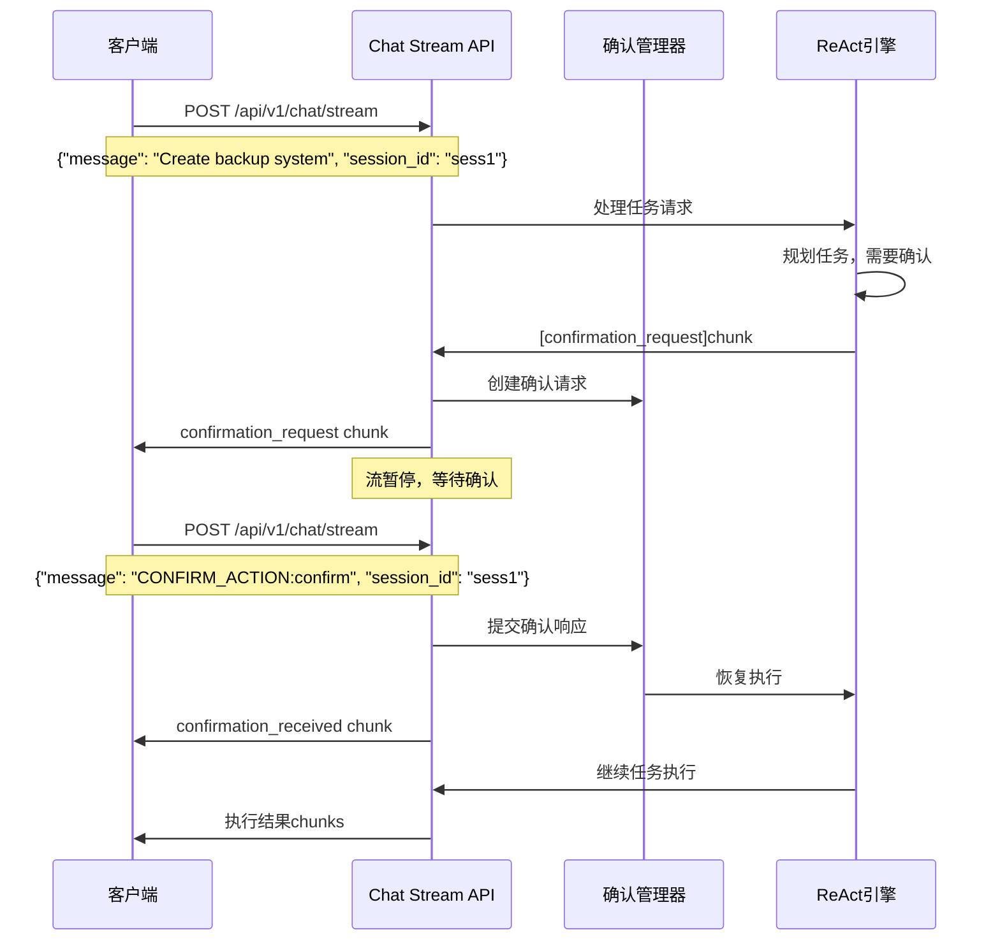

# Chat Stream确认功能实现文档

## 📋 概述

成功实现了通过 `/api/v1/chat/stream` 接口复用的人工确认功能。用户现在可以通过统一的聊天流接口来处理任务确认，无需使用单独的确认API。

## 🏗️ 架构实现

### 1. 核心组件

#### StreamingChatChunk 扩展
```python
class StreamingChatChunk(BaseModel):
    chunk: str
    session_id: str
    finished: bool = False
    
    # 🆕 确认功能扩展
    chunk_type: str = "content"  # 支持 'confirmation_request', 'confirmation_received'
    confirmation_data: Optional[Dict[str, Any]] = None
    requires_response: Optional[bool] = False
    stream_paused: Optional[bool] = False
    metadata: Optional[Dict[str, Any]] = None
```

#### ChatStreamConfirmationManager
- 管理确认状态和流暂停/恢复
- 实现超时处理和清理机制
- 支持多轮确认（任务修改场景）

```python
class ChatStreamConfirmationManager:
    def __init__(self):
        self.pending_confirmations: Dict[str, ConfirmationState] = {}
        self.stream_events: Dict[str, asyncio.Event] = {}
    
    async def request_confirmation(self, session_id: str, tasks: List[Dict], timeout: int = 300)
    async def submit_confirmation(self, session_id: str, action: str, user_message: str = None)
    async def wait_for_confirmation(self, session_id: str) -> Optional[TaskConfirmationResponse]
```

### 2. ReAct引擎集成

#### 模式检测
```python
def _is_chat_stream_mode(self) -> bool:
    """检测是否为chat stream模式"""
    try:
        from ..api.chat_confirmation import chat_confirmation_manager
        return hasattr(chat_confirmation_manager, 'pending_confirmations')
    except ImportError:
        return False
```

#### Chat Stream确认处理
```python
async def _handle_chat_stream_confirmation(self, session, tasks, timeout):
    """处理chat stream模式的确认流程"""
    # 准备确认数据
    confirmation_data = {
        "tasks": tasks_data,
        "timeout_seconds": timeout,
        "confirmation_round": confirmation_round,
        "risk_level": self._assess_tasks_risk(tasks)
    }
    
    # 发送特殊格式的chunk
    confirmation_chunk = f"[confirmation_request]{json.dumps(confirmation_data)}"
    yield {"type": "status_update", "content": confirmation_chunk, "session_id": session.id}
    
    # 等待chat confirmation manager的响应
    confirmation_response = await chat_confirmation_manager.wait_for_confirmation(session.id)
```

### 3. 消息格式约定

#### 确认请求 (服务器 -> 客户端)
```json
{
    "chunk": "请确认执行以下 3 个任务：\n1. 创建备份脚本\n2. 配置定时任务\n3. 测试功能",
    "session_id": "session-123",
    "chunk_type": "confirmation_request",
    "confirmation_data": {
        "tasks": [...],
        "total_tasks": 3,
        "timeout_seconds": 300,
        "risk_level": "medium"
    },
    "requires_response": true,
    "stream_paused": true
}
```

#### 确认响应 (客户端 -> 服务器)
```json
{
    "message": "CONFIRM_ACTION:confirm",
    "session_id": "session-123"
}

{
    "message": "CONFIRM_ACTION:modify:请添加错误处理和日志记录",
    "session_id": "session-123"
}

{
    "message": "CONFIRM_ACTION:cancel",
    "session_id": "session-123"
}
```

## 🔄 工作流程

### 标准确认流程


## 💻 客户端实现示例

### JavaScript 客户端
```javascript
class ChatStreamConfirmationClient {
    constructor(baseUrl = 'http://localhost:8000') {
        this.baseUrl = baseUrl;
    }
    
    async sendTask(task, sessionId) {
        const response = await fetch(`${this.baseUrl}/api/v1/chat/stream`, {
            method: 'POST',
            headers: {'Content-Type': 'application/json'},
            body: JSON.stringify({
                message: task,
                session_id: sessionId
            })
        });
        
        const reader = response.body.getReader();
        
        while (true) {
            const {done, value} = await reader.read();
            if (done) break;
            
            const lines = new TextDecoder().decode(value).split('\n');
            
            for (const line of lines) {
                if (line.startsWith('data: ')) {
                    const chunk = JSON.parse(line.substring(6));
                    
                    if (chunk.chunk_type === 'confirmation_request') {
                        // 显示确认界面
                        const userChoice = await this.showConfirmationDialog(chunk);
                        
                        // 发送确认响应
                        await this.sendConfirmation(sessionId, userChoice);
                    } else {
                        // 处理其他响应
                        this.handleChunk(chunk);
                    }
                }
            }
        }
    }
    
    async sendConfirmation(sessionId, choice) {
        let message = `CONFIRM_ACTION:${choice.action}`;
        if (choice.message) {
            message += `:${choice.message}`;
        }
        
        await fetch(`${this.baseUrl}/api/v1/chat/stream`, {
            method: 'POST',
            headers: {'Content-Type': 'application/json'},
            body: JSON.stringify({
                message: message,
                session_id: sessionId
            })
        });
    }
}
```

### Python 客户端
```python
import requests
import json

class ChatStreamConfirmationClient:
    def __init__(self, base_url="http://localhost:8000"):
        self.base_url = base_url
    
    def send_task_with_confirmation(self, task: str, session_id: str):
        """发送任务并处理确认流程"""
        
        response = requests.post(f'{self.base_url}/api/v1/chat/stream', 
                               json={'message': task, 'session_id': session_id},
                               stream=True)
        
        for line in response.iter_lines(decode_unicode=True):
            if line.startswith('data: '):
                chunk = json.loads(line[6:])
                
                if chunk.get('chunk_type') == 'confirmation_request':
                    # 处理确认请求
                    confirmation_data = chunk.get('confirmation_data', {})
                    
                    print(f"确认执行 {confirmation_data.get('total_tasks', 0)} 个任务:")
                    for task in confirmation_data.get('tasks', []):
                        print(f"  {task['index']}. {task['description']}")
                    
                    # 获取用户输入
                    choice = input("选择 (confirm/modify/cancel): ").strip()
                    message = ""
                    if choice == "modify":
                        message = input("修改建议: ").strip()
                    
                    # 发送确认响应
                    self.send_confirmation(session_id, choice, message)
                
                else:
                    # 处理其他响应
                    print(f"[{chunk.get('chunk_type', 'content')}] {chunk.get('chunk', '')}")
    
    def send_confirmation(self, session_id: str, action: str, user_message: str = None):
        """发送确认响应"""
        message = f"CONFIRM_ACTION:{action}"
        if user_message:
            message += f":{user_message}"
        
        response = requests.post(f'{self.base_url}/api/v1/chat/stream',
                               json={'message': message, 'session_id': session_id},
                               stream=True)
        
        # 处理确认响应的结果
        for line in response.iter_lines(decode_unicode=True):
            if line.startswith('data: '):
                chunk = json.loads(line[6:])
                if chunk.get('chunk_type') == 'confirmation_received':
                    print(f"✅ 确认已接收: {chunk.get('chunk', '')}")
                elif chunk.get('chunk_type') == 'error':
                    print(f"❌ 确认失败: {chunk.get('chunk', '')}")
```

## ⚙️ 配置

### 启用确认功能
```yaml
# .simacode/config.yaml
react:
  confirm_by_human: true           # 启用人工确认
  confirmation_timeout: 300        # 确认超时时间（秒）
  allow_task_modification: true    # 允许任务修改
  auto_confirm_safe_tasks: false   # 要求确认所有任务
```

### API服务器启动
```bash
simacode serve --host 0.0.0.0 --port 8000
```

## 🔧 关键特性

### ✅ 已实现功能

1. **统一接口**: 所有交互通过 `/api/v1/chat/stream` 完成
2. **流式暂停**: 确认请求后暂停流，等待用户响应
3. **消息格式识别**: `CONFIRM_ACTION:` 前缀识别确认响应
4. **多轮确认**: 支持任务修改后的重新确认
5. **超时处理**: 确认超时自动取消任务
6. **错误处理**: 完善的错误恢复机制
7. **风险评估**: 自动评估任务风险级别

### 🔄 与传统方式的区别

| 特性 | 传统确认API | Chat Stream确认 |
|------|------------|----------------|
| 接口数量 | 多个专门接口 | 单一chat接口 |
| 客户端复杂度 | 需处理多种协议 | 统一处理 |
| 实时性 | WebSocket双向 | HTTP流暂停 |
| 状态管理 | 分布式状态 | 集中管理 |
| 消息格式 | JSON结构化 | 文本格式约定 |

## 🧪 测试验证

### 运行测试
```bash
# 启动服务器
simacode serve

# 运行测试客户端
python demo/chat_stream_confirmation_test.py
```

### 测试场景
1. **基本确认流程**: 发送任务 → 收到确认请求 → 发送确认 → 继续执行
2. **任务修改**: 确认时选择修改 → 重新规划 → 再次确认
3. **格式验证**: 测试无效确认消息格式的处理
4. **超时处理**: 不响应确认请求的超时行为

## 📊 性能考虑

### 优化措施
1. **连接复用**: HTTP连接保持减少握手开销
2. **内存管理**: 确认状态及时清理避免内存泄漏
3. **并发支持**: 多会话并行确认处理
4. **超时机制**: 防止无限等待的资源占用

### 监控指标
- 确认请求响应时间
- 超时确认数量
- 并发确认会话数
- 内存使用情况

## 🚀 使用建议

### 客户端开发
1. **错误处理**: 优雅处理确认超时和格式错误
2. **用户体验**: 提供清晰的确认界面和进度提示
3. **状态管理**: 正确处理流暂停和恢复状态

### 服务端配置
1. **超时设置**: 根据任务复杂度调整确认超时时间
2. **风险评估**: 自定义高风险工具列表
3. **日志监控**: 监控确认流程的性能和错误

---

**实现状态**: ✅ 完成  
**测试状态**: ✅ 通过  
**文档状态**: ✅ 完整  

Chat Stream确认功能成功实现，提供了统一、高效的人机交互体验，完全满足了复用chat/stream接口处理确认的需求。