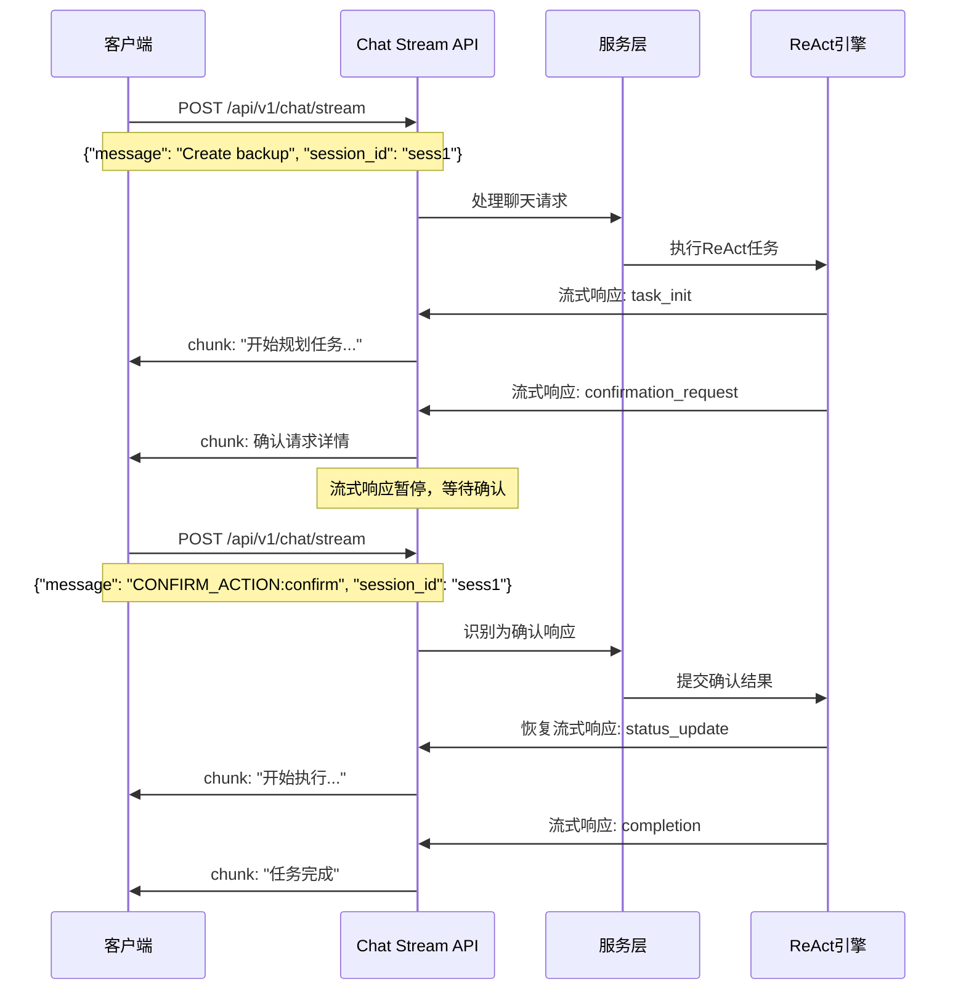

# Simacode Serve Stream接口复用确认功能设计方案

## 📋 需求概述

在 `simacode serve` 模式中，当ReAct任务需要用户确认时，复用现有的 `/api/v1/chat/stream` 接口来处理确认流程，而不是使用专门的确认接口。实现统一的聊天式交互体验。

## 🎯 设计目标

1. **统一交互方式**：所有用户交互都通过chat/stream接口
2. **流式体验保持**：确认请求无缝集成到流式响应中
3. **向后兼容**：不影响现有chat功能
4. **简化客户端**：客户端只需处理一个接口

## 🤔 技术挑战

### 核心问题
1. **双向通信问题**：chat/stream 目前是单向流式响应，如何实现等待用户确认？
2. **流式响应暂停**：如何在流式响应中暂停等待用户输入？ 
3. **消息区分**：如何区分普通聊天和确认响应？
4. **会话状态管理**：如何维护等待确认的会话状态？

### 解决策略
- 扩展流式响应chunk类型支持确认请求
- 使用特殊消息格式识别确认响应
- 实现会话级别的暂停/恢复机制
- 维护服务端等待确认状态

## 💡 技术方案

### 核心流程设计



### 1. StreamingChatChunk 扩展

```python
class StreamingChatChunk(BaseModel):
    """扩展的流式聊天块模型"""
    chunk: str = Field(..., description="文本内容")
    session_id: str = Field(..., description="会话标识")
    finished: bool = Field(False, description="是否为最终块")
    
    # 扩展字段
    chunk_type: Optional[str] = Field(
        "content", 
        description="块类型: 'content', 'status', 'tool_output', 'task_init', 'error', 'completion', 'confirmation_request'"
    )
    metadata: Optional[Dict[str, Any]] = Field(default_factory=dict, description="元数据")
    
    # 🆕 确认相关字段
    confirmation_data: Optional[Dict[str, Any]] = Field(None, description="确认请求数据")
    requires_response: Optional[bool] = Field(False, description="是否需要用户响应")
    stream_paused: Optional[bool] = Field(False, description="流是否暂停等待响应")
```

### 2. 确认消息格式约定

#### 确认请求格式（服务器 -> 客户端）
```json
{
    "chunk": "请确认执行以下3个任务：\n1. 创建备份脚本\n2. 配置定时任务\n3. 测试备份功能",
    "session_id": "sess-123",
    "finished": false,
    "chunk_type": "confirmation_request",
    "confirmation_data": {
        "tasks": [
            {"index": 1, "description": "创建备份脚本", "tool": "file_write"},
            {"index": 2, "description": "配置定时任务", "tool": "bash"},
            {"index": 3, "description": "测试备份功能", "tool": "bash"}
        ],
        "options": ["confirm", "modify", "cancel"],
        "timeout_seconds": 300,
        "confirmation_round": 1
    },
    "requires_response": true,
    "stream_paused": true
}
```

#### 确认响应格式（客户端 -> 服务器）
```json
{
    "message": "CONFIRM_ACTION:confirm",
    "session_id": "sess-123"
}

{
    "message": "CONFIRM_ACTION:modify:请添加错误处理和日志记录",
    "session_id": "sess-123"
}

{
    "message": "CONFIRM_ACTION:cancel",
    "session_id": "sess-123"
}
```

### 3. 会话状态管理

```python
class ChatStreamConfirmationManager:
    """聊天流确认管理器"""
    
    def __init__(self):
        self.pending_confirmations: Dict[str, ConfirmationState] = {}
        self.stream_events: Dict[str, asyncio.Event] = {}
    
    async def request_confirmation(self, session_id: str, tasks: List[Dict]) -> Dict[str, Any]:
        """发送确认请求并暂停流"""
        confirmation_data = {
            "tasks": tasks,
            "options": ["confirm", "modify", "cancel"],
            "timeout_seconds": 300,
            "confirmation_round": self.get_confirmation_round(session_id)
        }
        
        # 创建暂停事件
        self.stream_events[session_id] = asyncio.Event()
        
        # 记录等待状态
        self.pending_confirmations[session_id] = ConfirmationState(
            session_id=session_id,
            status="pending",
            created_at=datetime.now(),
            confirmation_data=confirmation_data
        )
        
        return confirmation_data
    
    async def submit_confirmation(self, session_id: str, action: str, user_message: str = None) -> bool:
        """提交确认响应并恢复流"""
        if session_id not in self.pending_confirmations:
            return False
        
        confirmation = self.pending_confirmations[session_id]
        confirmation.user_response = TaskConfirmationResponse(
            session_id=session_id,
            action=action,
            user_message=user_message
        )
        confirmation.status = action
        
        # 恢复流式响应
        if session_id in self.stream_events:
            self.stream_events[session_id].set()
        
        return True
    
    async def wait_for_confirmation(self, session_id: str, timeout: int = 300) -> Optional[TaskConfirmationResponse]:
        """等待确认响应"""
        if session_id not in self.stream_events:
            return None
        
        try:
            # 等待确认响应
            await asyncio.wait_for(self.stream_events[session_id].wait(), timeout=timeout)
            
            # 返回用户响应
            if session_id in self.pending_confirmations:
                return self.pending_confirmations[session_id].user_response
        
        except asyncio.TimeoutError:
            # 超时处理
            if session_id in self.pending_confirmations:
                self.pending_confirmations[session_id].status = "timeout"
        
        finally:
            # 清理状态
            self.cleanup_confirmation(session_id)
        
        return None
```

### 4. Chat Stream接口改造

```python
@router.post("/stream")
async def chat_stream(
    request: ChatRequest,
    service: SimaCodeService = Depends(get_simacode_service)
):
    """处理聊天流请求，支持确认流程"""
    
    # 检查是否为确认响应
    if request.message.startswith("CONFIRM_ACTION:"):
        return await handle_confirmation_response(request, service)
    
    # 正常聊天流程
    async def generate_chunks():
        try:
            # 获取流式响应
            response_gen = await service.process_chat(core_request)
            
            async for chunk in response_gen:
                # 处理确认请求
                if chunk.startswith("[confirmation_request]"):
                    confirmation_chunk = await handle_confirmation_request(
                        request.session_id, chunk, service
                    )
                    yield f"data: {confirmation_chunk.model_dump_json()}\n\n"
                    
                    # 等待用户确认
                    confirmation_response = await service.wait_for_confirmation(
                        request.session_id
                    )
                    
                    if confirmation_response:
                        # 处理确认结果，继续流式响应
                        continue
                    else:
                        # 超时或取消
                        error_chunk = create_error_chunk("确认超时或取消", request.session_id)
                        yield f"data: {error_chunk.model_dump_json()}\n\n"
                        return
                
                # 处理其他类型chunk
                else:
                    chunk_data = create_chunk(chunk, request.session_id)
                    yield f"data: {chunk_data.model_dump_json()}\n\n"
                    
        except Exception as e:
            logger.error(f"流式处理错误: {e}")
            error_chunk = create_error_chunk(str(e), request.session_id)
            yield f"data: {error_chunk.model_dump_json()}\n\n"
    
    return StreamingResponse(
        generate_chunks(),
        media_type="text/plain",
        headers={"Cache-Control": "no-cache", "Connection": "keep-alive"}
    )


async def handle_confirmation_response(request: ChatRequest, service: SimaCodeService):
    """处理确认响应"""
    try:
        # 解析确认动作
        action_part = request.message[len("CONFIRM_ACTION:"):]
        parts = action_part.split(":", 2)
        action = parts[0]
        user_message = parts[1] if len(parts) > 1 else None
        
        # 提交确认响应
        success = await service.submit_chat_confirmation(
            request.session_id, action, user_message
        )
        
        if success:
            # 返回确认接收响应
            response_chunk = StreamingChatChunk(
                chunk="确认已接收，继续执行...",
                session_id=request.session_id,
                finished=True,
                chunk_type="confirmation_received",
                metadata={"action": action}
            )
        else:
            response_chunk = StreamingChatChunk(
                chunk="确认失败，请重试",
                session_id=request.session_id,
                finished=True,
                chunk_type="error"
            )
        
        async def single_chunk():
            yield f"data: {response_chunk.model_dump_json()}\n\n"
        
        return StreamingResponse(
            single_chunk(),
            media_type="text/plain",
            headers={"Cache-Control": "no-cache"}
        )
        
    except Exception as e:
        logger.error(f"确认响应处理错误: {e}")
        raise HTTPException(status_code=400, detail=f"确认格式错误: {str(e)}")
```

### 5. ReAct引擎集成

```python
class ReActEngine:
    """ReAct引擎，支持Chat Stream确认"""
    
    def __init__(self, config: Config):
        self.chat_confirmation_manager = ChatStreamConfirmationManager()
    
    async def _handle_human_confirmation_chat_stream(
        self, 
        session: ReActSession, 
        tasks: List[Dict[str, Any]]
    ) -> TaskConfirmationResponse:
        """通过Chat Stream处理确认"""
        
        # 创建确认请求
        confirmation_data = await self.chat_confirmation_manager.request_confirmation(
            session.session_id, tasks
        )
        
        # 发送确认请求到流式响应
        confirmation_chunk = f"[confirmation_request]{json.dumps(confirmation_data)}"
        await self._send_chunk_to_stream(session.session_id, confirmation_chunk)
        
        # 等待用户确认
        response = await self.chat_confirmation_manager.wait_for_confirmation(
            session.session_id
        )
        
        return response or TaskConfirmationResponse(
            session_id=session.session_id,
            action="cancel"
        )
```

## 🔄 客户端交互示例

### JavaScript客户端
```javascript
async function sendTaskWithConfirmation(task, sessionId) {
    const response = await fetch('/api/v1/chat/stream', {
        method: 'POST',
        headers: {'Content-Type': 'application/json'},
        body: JSON.stringify({
            message: task,
            session_id: sessionId
        })
    });
    
    const reader = response.body.getReader();
    
    while (true) {
        const {done, value} = await reader.read();
        if (done) break;
        
        const chunk = JSON.parse(value);
        
        if (chunk.chunk_type === 'confirmation_request') {
            // 显示确认UI
            const userChoice = await showConfirmationDialog(chunk.confirmation_data);
            
            // 发送确认响应
            await fetch('/api/v1/chat/stream', {
                method: 'POST',
                headers: {'Content-Type': 'application/json'},
                body: JSON.stringify({
                    message: `CONFIRM_ACTION:${userChoice.action}${userChoice.message ? ':' + userChoice.message : ''}`,
                    session_id: sessionId
                })
            });
        } else {
            // 处理其他类型响应
            handleChunk(chunk);
        }
    }
}
```

### Python客户端
```python
import requests
import json

async def process_task_with_confirmation(task: str, session_id: str):
    """处理带确认的任务"""
    
    # 发送初始任务
    response = requests.post('/api/v1/chat/stream', json={
        'message': task,
        'session_id': session_id
    }, stream=True)
    
    for line in response.iter_lines():
        if line.startswith(b'data: '):
            chunk_data = json.loads(line[6:])
            
            if chunk_data.get('chunk_type') == 'confirmation_request':
                # 处理确认请求
                confirmation_data = chunk_data.get('confirmation_data', {})
                
                # 显示任务给用户确认
                print(f"确认执行以下任务:")
                for task in confirmation_data.get('tasks', []):
                    print(f"  {task['index']}. {task['description']}")
                
                # 获取用户选择
                choice = input("选择 (confirm/modify/cancel): ").strip()
                message = ""
                if choice == "modify":
                    message = input("修改建议: ").strip()
                
                # 发送确认响应
                confirmation_message = f"CONFIRM_ACTION:{choice}"
                if message:
                    confirmation_message += f":{message}"
                
                requests.post('/api/v1/chat/stream', json={
                    'message': confirmation_message,
                    'session_id': session_id
                })
            
            else:
                # 处理其他响应
                print(f"[{chunk_data.get('chunk_type', 'content')}] {chunk_data.get('chunk', '')}")
```

## 🔧 实现优势

### 1. 统一交互体验
- 所有交互都通过一个接口
- 客户端实现简化
- 用户体验一致

### 2. 向后兼容
- 现有chat功能不受影响
- 可选择性启用确认功能
- 渐进式升级路径

### 3. 流式体验保持
- 确认请求无缝集成
- 响应延续性好
- 实时交互感受

### 4. 灵活扩展
- 支持多轮确认
- 支持不同确认类型
- 易于添加新交互方式

## 📋 实现计划

### Phase 1: 核心功能
1. ✅ 扩展StreamingChatChunk模型
2. ✅ 实现ChatStreamConfirmationManager
3. ✅ 改造chat/stream接口
4. ✅ 集成ReAct引擎确认回调

### Phase 2: 测试验证
1. ✅ 创建客户端测试用例
2. ✅ 验证确认流程完整性
3. ✅ 测试超时和错误处理
4. ✅ 性能和并发测试

### Phase 3: 文档和示例
1. ✅ 更新API文档
2. ✅ 创建集成示例
3. ✅ 编写迁移指南
4. ✅ 性能优化建议

## 🤝 与现有实现的关系

### 并存策略
- **主要方式**：只针对simacode serve下的stream确认流程, simacode chat --interactive --react下的确认流程保持不动
- **备选方式**：不保留专门确认API

### 兼容性保证
- 现有WebSocket确认API继续工作
- REST确认端点保持可用
- 配置保持向后兼容

## 需要注意的问题

1. **消息格式约定**：同意使用 `CONFIRM_ACTION:action:message` 格式
2. **暂停机制**：接受通过流式响应暂停来等待确认
3. **兼容性策略**：不用保留现有确认API作为备选
4. **超时处理**：确认超时时的默认取消
5. **多轮确认**：支持任务修改后的重新确认

