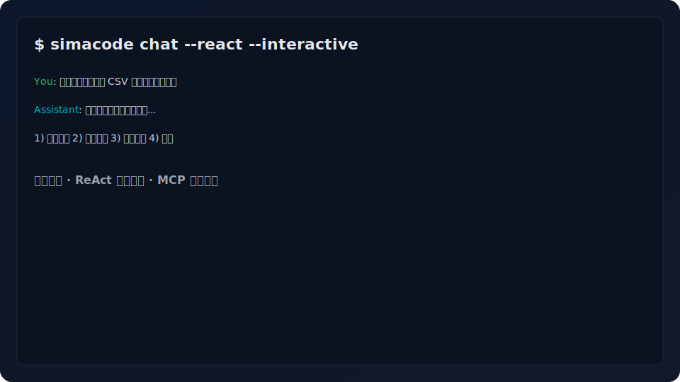
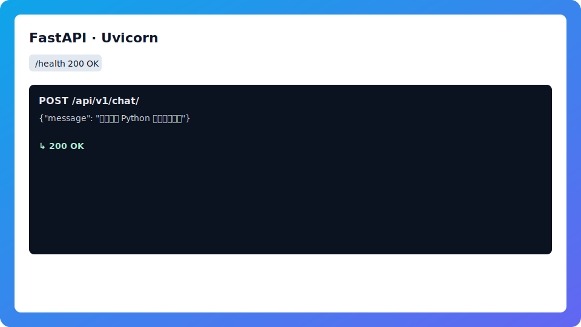
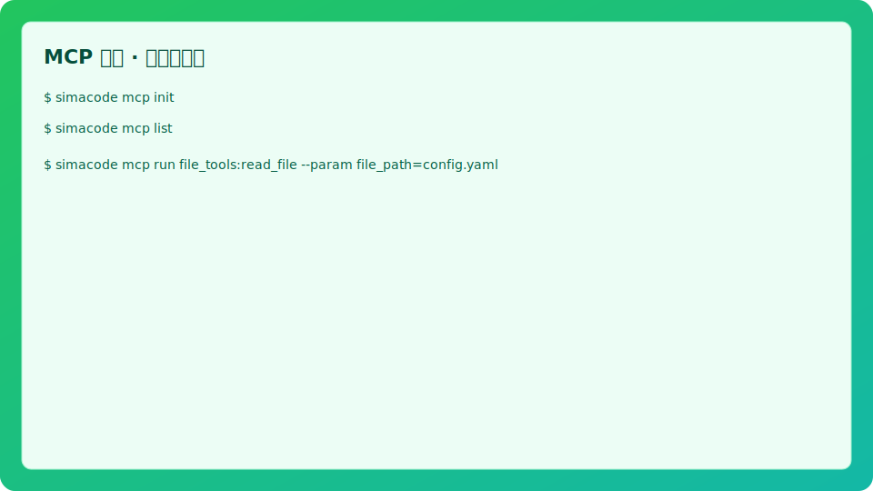

<div class="hero">
  
  <h1 class="hero-title">SimaCode</h1>
  <p class="hero-subtitle">现代 AI 编程助手 · ReAct 任务规划 · MCP 工具集成 · CLI / API 双模式</p>
  <div class="cta-buttons">
    <a class="button primary" href="quickstart/">开始使用</a>
    <a class="button ghost" href="https://github.com/simacode/simacode" target="_blank" rel="noopener">GitHub</a>
  </div>
</div>

<div class="announce">
  <span class="badge">New</span>
  <span>v0.1 预览：更强 ReAct 规划与 MCP 体验，查看 <a href="quickstart/">快速开始</a> 或 <a href="roadmap/">路线图</a>。</span>
  
</div>

## 为什么选择 SimaCode

- 智能 ReAct：结合“思考 + 行动”，自动规划并执行任务。
- MCP 工具：统一接入文件/网络/数据等外部工具，AI/直连皆可。
- 双模式：个人 CLI 高效开发，API 便于系统集成与自动化。
- 工程化：类型检查、格式化、Lint、测试覆盖率一应俱全。

## 三步上手

```bash
poetry install
poetry run simacode chat --react --interactive
poetry run simacode serve --reload --debug
```

## 功能速览

<div class="grid cards" markdown="1">

-   [:material-console: CLI 体验](examples/#cli-对话)
    交互与流式输出，适合日常开发与快速验证。

-   [:material-api: API 集成](examples/#api-请求)
    基于 FastAPI 的接口，易集成、易扩展。

-   [:material-puzzle: MCP 工具](examples/#mcp-工具)
    自动发现与执行，支持 AI 调用与手动调用。

-   [:material-family-tree: 清晰架构](architecture/)
    核心共享、接口分层，易维护、好扩展。

-   [:material-lifebuoy: 故障排查](troubleshooting/)
    网络代理/MCP 常见问题与解决方案。

-   [:material-progress-clock: 异步任务](features/)
    支持异步与并发处理，提升吞吐与响应速度。

-   [:material-toolbox: 内嵌工具](features/)
    内置并可扩展多种工具，便于组合调用与编排。

-   [:material-robot: ReAct 规划](features/)
    从对话到执行，AI编排工具，自动完成目标。

</div>

> 本站采用轻定制样式，保持 MkDocs 的简洁与可维护性，同时呈现更“产品化”的首屏与功能卡片。

## 界面预览

<div class="gallery">
  <figure>
    
    <figcaption>CLI 交互与流式输出</figcaption>
  </figure>
  <figure>
    
    <figcaption>API 启动与健康检查</figcaption>
  </figure>
  <figure>
    
    <figcaption>MCP 工具发现与执行</figcaption>
  </figure>
  
</div>

## 信任与指标

<div class="badge-row">
  <a href="https://github.com/simacode/simacode" target="_blank" rel="noopener">
    
  </a>
  
  
  
  
  
</div>

## 快速对比

| 维度 | SimaCode | n8n | Dify |
|------|----------|-----|------|
| 定位 | ReAct 编排的开发者助手/Agent 基座 | 可视化自动化与集成平台 | LLM 应用/Agent 构建平台 |
| 编排方式 | 目标→步骤，AI 编排 MCP 工具 | 节点/工作流拖拽 | Flow/Graph + 组件、Agent 场景 |
| 使用方式 | CLI + API（FastAPI） | Web UI + Self-host/Cloud | Web 控制台 + API |
| 工具生态 | MCP 工具/系统工具，可自定义 | 上百第三方节点集成 | 模型/检索/工具插件，可扩展 |
| 触发与自动化 | CLI/HTTP 触发，任务/会话上下文 | 触发器/定时/事件驱动 | 工作流/回调/定时 |
| 典型场景 | 开发自动化、业务工作流、可控 Agent | 系统集成、ETL、通知、业务流程 | LLM 应用、RAG、Agent Studio |
| 可扩展性 | Python 扩展 + MCP 服务器接入 | 自定义节点/函数 | 插件/函数调用/工具接入 |
| 部署 | 本地 CLI/API 服务 | Docker/self-host 或云 | Docker/self-host 或云 |

> 目标是兼顾“探索（AI 决策）”与“可控（你来驱动）”，既能独立使用，也便于集成到现有系统。

<!-- 用户背书版块已移除 -->
